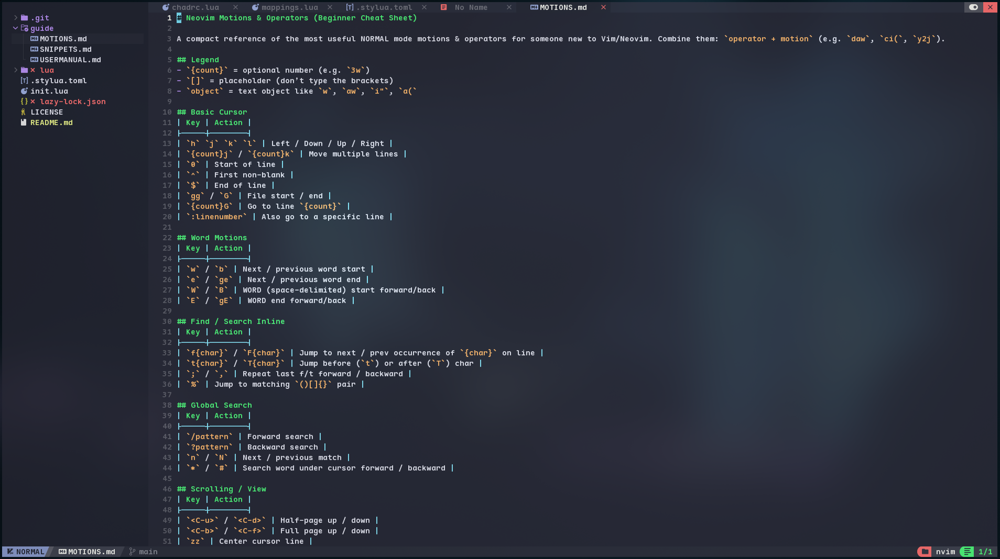
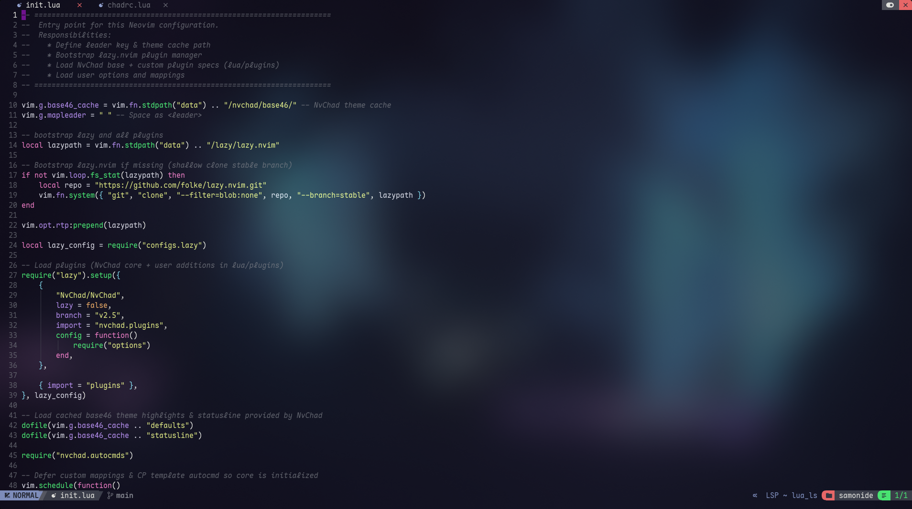

<div align="center">

# Neovim Config (NvChad v2.5 Layer)

Minimal, fast, and competitive‑programming friendly Neovim setup built on top of **NvChad**.


</div>

## 📋 Prerequisites

Install first:
* Neovim >= 0.9
* Git
* A Nerd Font (for icons) – e.g. FiraCode / JetBrainsMono Nerd Font

Optional (installed/managed automatically when configured): LSP servers, linters, formatters.

## ✨ Highlights

* NvChad core (theme system, statusline, bufferline, tree, telescope)
* Competitive Programming helpers (compile/run, test harness, optimization profile cycling, reusable terminal)
* Auto‑insert C++ template on new `*.cpp` file + `cp` snippet
* Dashboard (alpha.nvim) + Enhanced UI & command popup border feedback (noice.nvim)
* Diagnostics UI (trouble.nvim) & Quick Navigation (harpoon)
* Tasks (overseer.nvim) & Formatting/Linting (conform + nvim-lint + mason bridges)
* Snippets (LuaSnip + friendly-snippets + custom `cp` C++ template)

Guides: [User Manual](./guide/USERMANUAL.md) · [Snippets](./guide/SNIPPETS.md) · [Motions](./guide/MOTIONS.md)

## � Screenshots

Dashboard (Alpha) | Editing (Normal) | Transparent UI
:--:|:--:|:--:
 |  | 


## �📦 Installation Options

### Option A: Fresh Install (Replace Existing Config)
```bash
backup_dir="$HOME/.config/nvim_backup_$(date +%s)" && \
mv ~/.config/nvim "$backup_dir" 2>/dev/null || true && \
mv ~/.local/share/nvim "$backup_dir-data" 2>/dev/null || true && \
mv ~/.cache/nvim "$backup_dir-cache" 2>/dev/null || true && \
git clone https://github.com/samonide/nvim ~/.config/nvim && \
nvim
```

### Option B: Git Subdirectory (Manage as Git Submodule in dotfiles)
```bash
mkdir -p ~/.config && \
git submodule add https://github.com/samonide/nvim ~/.config/nvim || git clone https://github.com/samonide/nvim ~/.config/nvim && \
nvim
```

### Option C: Try Ephemeral (No Overwrite) Using `XDG_CONFIG_HOME`
```bash
TMPDIR=$(mktemp -d)
git clone https://github.com/samonide/nvim "$TMPDIR/nvim"
XDG_CONFIG_HOME="$TMPDIR" XDG_DATA_HOME="$TMPDIR/data" XDG_STATE_HOME="$TMPDIR/state" XDG_CACHE_HOME="$TMPDIR/cache" nvim
```

## 🚀 Quick Start
1. Launch Neovim (`nvim`).
2. Let `lazy.nvim` install plugins.
3. Open the dashboard (auto) or run `:Alpha`.
4. Press `<leader>ch` (NvChad cheatsheet) or `<leader>wK` (WhichKey) to explore.
5. For C++: create `main.cpp`, type `cp<Tab>` for full template or `cb<Tab>` for simple boilerplate, then `<leader>cr` to compile & run.

## 🗂 Structure
| Path | Purpose |
|------|---------|
| `init.lua` | Entry point: bootstraps plugin manager + mappings |
| `lua/chadrc.lua` | NvChad UI & theme overrides |
| `lua/options.lua` | Core editor options & shell override |
| `lua/mappings.lua` | All custom keymaps (CP + tooling) |
| `lua/plugins/` | Additional plugin specs |
| `lua/configs/` | Per-plugin configuration modules |
| `guide/USERMANUAL.md` | Comprehensive user & keymap manual |
| `guide/SNIPPETS.md` | Competitive programming snippets reference |
| `guide/MOTIONS.md` | Beginner Vim motions & operators cheat sheet |

## 🧠 Competitive Programming Toolkit
Feature | Keymaps
--------|--------
Compile & Run | `<leader>cr` / `<leader>cb`
Run last binary | `<leader>ce`
Run tests (tests/*.in) | `<leader>ctt`
Run with I/O files | `<C-A-n>` (**NEW**: input.txt → output.txt)
Optimization profile cycle | `<leader>co`
Redirect input.txt | `<leader>ct`
Open input.txt | `<leader>ci`
Templates | `cp` (full competitive), `cb` (simple boilerplate)

## 🔧 Customization Tips
* Add more LSP servers in `configs/lspconfig.lua` & rerun Neovim.
* Extend Treesitter parsers in `configs/treesitter.lua`.
* Add formatters/linters via conform / nvim-lint config files.
* Place new snippets with LuaSnip in a dedicated module or VSCode-style JSON.

## ♻️ Updating / Syncing
```bash
cd ~/.config/nvim
git pull --rebase
:Lazy sync
```

Commit `lazy-lock.json` to lock plugin versions.

To update just plugins without git changes: inside Neovim run `:Lazy sync` (or `:Lazy check` to inspect outdated first).

## 🐛 Troubleshooting (Quick)
Issue | Check
------|------
Missing highlight | `:TSInstall <lang>`
Formatter not running | `<leader>fm` / check filetype mapping
LSP inactive | `:LspInfo` / `:Mason`
Test harness mismatch | Ensure `tests/*.out` files exist
Icons wrong | Install & select a Nerd Font in terminal
## 📜 License
See [`LICENSE`](./LICENSE).

---
Happy hacking! For deep usage details, read the full manual in [guide/USERMANUAL.md](./guide/USERMANUAL.md).
