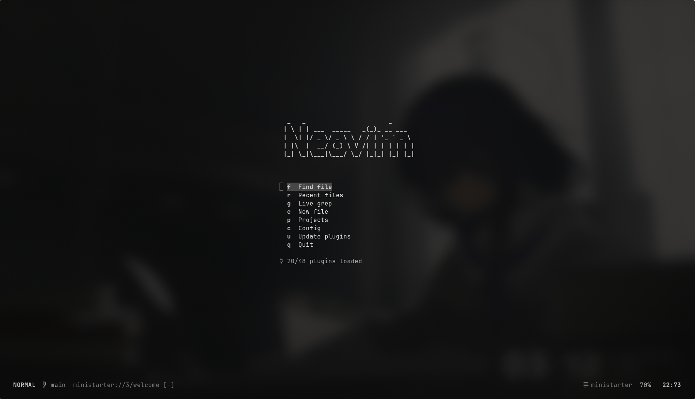
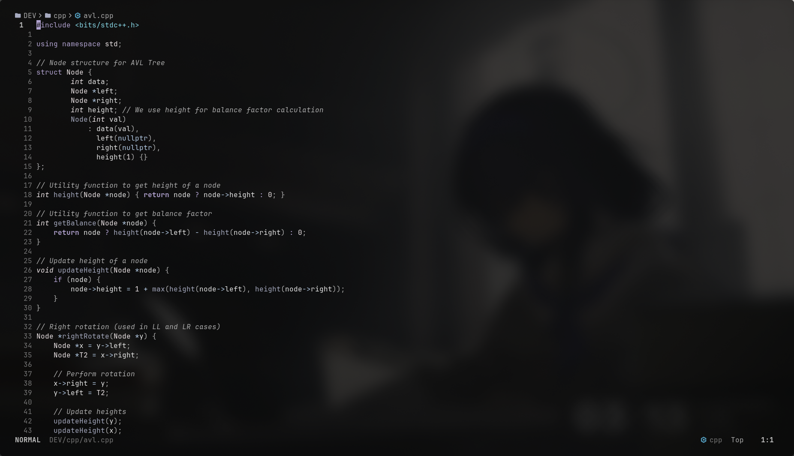
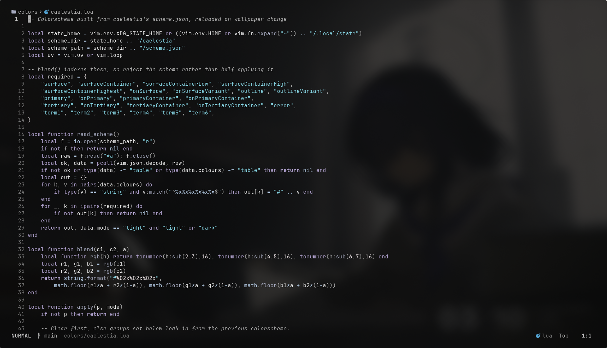
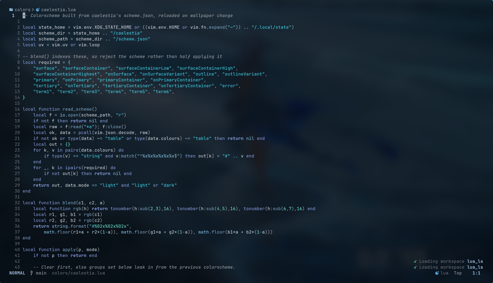

# nvim

My Neovim setup. Plain lazy.nvim config, no distro. Written for competitive
programming, themed by Caelestia — the colors follow my wallpaper and the
terminal runs transparent.






## Install

```bash
mv ~/.config/nvim ~/.config/nvim.bak  # skip if fresh
git clone https://github.com/samonide/nvim ~/.config/nvim
nvim  # plugins install themselves, wait a minute
```

Needs: Neovim >= 0.11, git, a Nerd Font, `make` (for fzf-native).
Optional: the [`pi`](https://pi.dev) CLI for the `<leader>ap` agent sidebar.

## Keys

Leader is `Space`. Press it and wait — WhichKey shows what's available.
Full list in [guide/MOTIONS.md](guide/MOTIONS.md).

The ones I use constantly:

| Key | Does |
|-----|------|
| `cp` + Tab | full CP template (in a cpp file) |
| `<leader>cr` | compile + run |
| `<leader>ci` | run with `input.txt` |
| `<leader>ctt` | run all tests in `tests/` |
| `<leader>ff` / `fg` / `fw` | find files / grep / live grep |
| `<leader>e` / `<C-n>` | file tree |
| `<leader>ap` | pi agent sidebar |
| `<A-i>` | floating terminal |
| `s` | flash jump |
| `<F6>` | code outline |

Deletes go to the void register — `d` never touches the clipboard.
Yanks still do (`unnamedplus`). Undo is always there.

## Theme

There is no theme picker. Caelestia writes `scheme.json` on wallpaper
change, `colors/caelestia.lua` watches it and re-themes Neovim live —
editor, lualine, everything. `<leader>th` re-applies it by hand if
something looks stale.

## Layout

```
lua/
  options.lua     editor options
  mappings.lua    all keymaps
  configs/        one file per plugin (lspconfig, cmp, telescope, ...)
  plugins/        plugin specs (init.lua)
colors/
  caelestia.lua   colorscheme built from scheme.json
```

LSP servers live in one list (`lua/configs/servers.lua`) shared by
lspconfig and mason — add a name there and it's installed + configured.
Formatters go in `configs/conform.lua`, linters in `configs/lint.lua`.

## Plugins

48 total, pinned in `lazy-lock.json`.

- **core**: lazy.nvim, plenary, which-key, telescope (+fzf-native), nvim-tree, devicons
- **code**: nvim-treesitter (+context), nvim-lspconfig, mason (+lspconfig/conform/lint bridges), nvim-cmp (+lsp/buffer/lua/path/snippets sources), LuaSnip, autopairs, conform, nvim-lint
- **look**: caelestia colorscheme, lualine, dropbar breadcrumbs, aerial outline, indent-blankline, smear-cursor, mini.starter, noice, trouble, todo-comments, showkeys
- **move**: harpoon, flash, surround
- **git**: gitsigns, diffview
- **cp**: runner.nvim, timesense.nvim
- **agents**: pi2.nvim (+render-markdown), floaterm, cord (discord presence, `<leader>cd` toggles)

## Trouble

| Symptom | Fix |
|---------|-----|
| no highlighting | `:TSInstall <lang>` |
| LSP missing | `:Mason`, install it; check `:LspInfo` |
| broken icons | terminal font must be a Nerd Font |
| plugin errors at start | `:Lazy sync`, restart |

Unlicense — do whatever you want with it.
