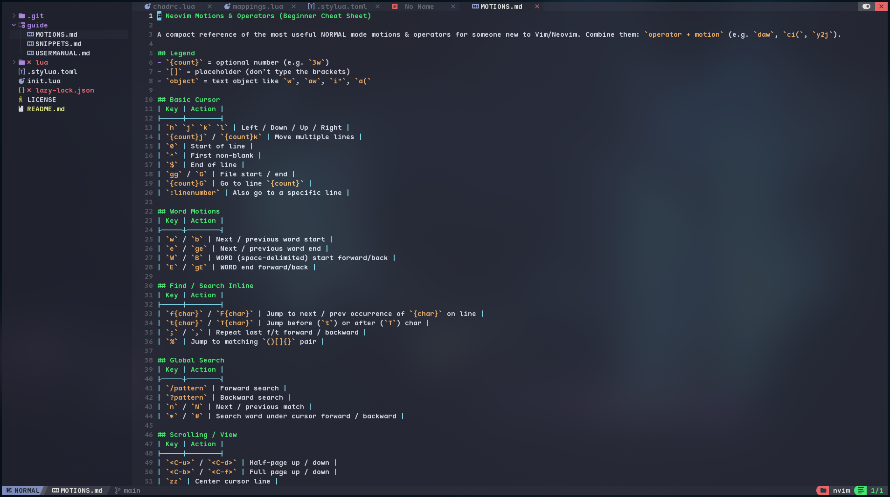
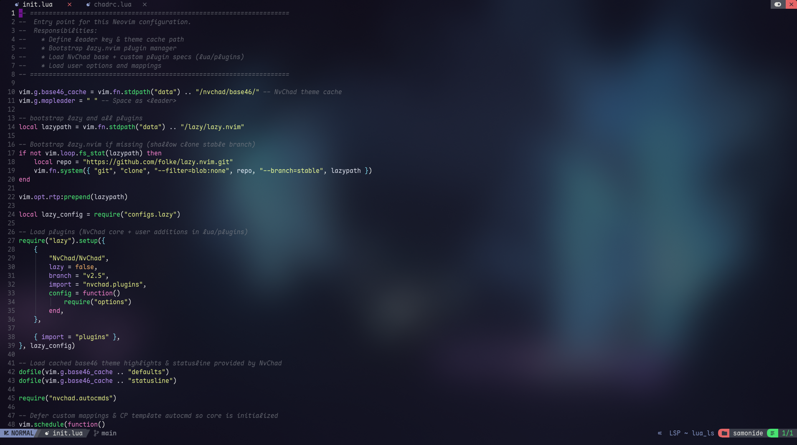

<div align="center">

# Neovim Config (Standalone, Caelestia Themed)

Refined, fast, and competitive‑programming focused Neovim setup. Standalone
lazy.nvim config — no distribution dependency. Theming via **Caelestia**
(`colors/caelestia.lua` reads `scheme.json`, live-updates on wallpaper change).


*Clean keybinds · No conflicts · Optimized for competitive programming*

</div>

---

## 📋 Prerequisites

**Required:**
* Neovim >= 0.11 (`vim.lsp.config` API)
* Git
* A Nerd Font (for icons) – e.g. FiraCode Nerd Font, JetBrainsMono Nerd Font
* `make` (for telescope-fzf-native compilation)

**Optional** (auto-installed via Mason when needed):
* LSP servers (clangd, pyright, etc.)
* Linters (cpplint, pylint, etc.)
* Formatters (clang-format, black, etc.)

---

## ✨ Key Features

### 🎯 Core Highlights
* **Standalone Foundation**: Pure lazy.nvim setup — zero distribution dependencies
* **Caelestia Theme System**: Wallpaper-driven Material You scheme, live-updates Neovim with no restart
* **Conflict-Free Keybinds**: All keybinds refactored with no duplicates or conflicts
* **Competitive Programming Optimized**: Fast compile/run, test harness, I/O file handling, and optimization profiles
* **System Clipboard Integration**: Yank operations automatically sync to system clipboard
* **Smart Terminal Management**: Separate floating, horizontal, and vertical terminals that properly toggle

### 🏃 Competitive Programming Toolkit
* **runner.nvim**: Lightning-fast code execution with compile/run, test harness, optimization profiles
* **timesense.nvim**: Real-time complexity analysis (O(n), O(log n)) & coding statistics
* **Auto C++ Templates**: Type `cp` for full competitive template or `cb` for simple boilerplate
* **I/O File Integration**: Run with `input.txt` → `output.txt` via `<C-A-n>`
* **Test Suite Runner**: Execute all tests in `tests/` directory with `<leader>ctt`
* **Watch Mode**: Auto-recompile on file save with `<leader>cw`

### 🎨 UI & Navigation
* **Dashboard**: Minimalistic startup screen (mini.starter)
* **Enhanced Command Line**: Centered popup with dynamic border colors (noice.nvim)
* **Smart Notifications**: Non-intrusive notifications (noice.nvim)
* **Diagnostics UI**: Beautiful error/warning display (trouble.nvim)
* **Quick File Marks**: Harpoon for instant navigation between 4 frequently-used files
* **Flash Navigation**: Jump anywhere with labeled hints
* **Git Integration**: Diff viewer and file history (diffview.nvim)

### 💻 Development Features
* **LSP Integration**: Full language server support with auto-install
* **Treesitter**: Advanced syntax highlighting and text objects
* **Auto-formatting**: Format on save with conform.nvim
* **Async Linting**: Real-time error detection with nvim-lint
* **Smart Commenting**: Native `gc` commenting (`<leader>/`)
* **TODO Highlighting**: Highlight and navigate TODO/FIXME/NOTE comments
* **Surround Operations**: Easy manipulation of quotes, brackets, tags
* **Discord Rich Presence**: Show your coding activity (optional, toggle with `<leader>cd`)

---

## 📷 Screenshots

Dashboard (mini.starter) | Editing (Normal) | Transparent UI
:--:|:--:|:--:
 |  | 

---

## 📦 Installation

### Option A: Fresh Install (Recommended)
```bash
# Backup existing config
backup_dir="$HOME/.config/nvim_backup_$(date +%s)" && \
mv ~/.config/nvim "$backup_dir" 2>/dev/null || true && \
mv ~/.local/share/nvim "$backup_dir-data" 2>/dev/null || true && \
mv ~/.cache/nvim "$backup_dir-cache" 2>/dev/null || true && \

# Clone this config
git clone https://github.com/samonide/nvim ~/.config/nvim && \

# Launch Neovim (plugins will auto-install)
nvim
```

### Option B: Try Without Installing (Ephemeral)
```bash
TMPDIR=$(mktemp -d)
git clone https://github.com/samonide/nvim "$TMPDIR/nvim"
XDG_CONFIG_HOME="$TMPDIR" XDG_DATA_HOME="$TMPDIR/data" XDG_CACHE_HOME="$TMPDIR/cache" nvim
```

---

## 🚀 Quick Start Guide

1. **Launch Neovim**: `nvim`
2. **Wait for plugins**: Lazy.nvim will auto-install all plugins on first launch
3. **Explore keybinds**: Press `<Space>` (leader) and wait → WhichKey shows available options
4. **Find keymaps**: `<Space>fk` → Search all keymaps interactively
5. **C++ Quick Start**:
   - Create `main.cpp`
   - Type `cp<Tab>` → Full competitive programming template
   - Type `cb<Tab>` → Simple C++ boilerplate
   - Press `<Space>cr` → Compile and run
   - Press `<Space>ci` → Run with `input.txt`

---

## ⌨️ Essential Keybinds

> **Leader Key**: `Space` | Full cheatsheet: [guide/MOTIONS.md](./guide/MOTIONS.md)

---

## 🗂️ Project Structure

```
~/.config/nvim/
├── init.lua                    # Entry point: bootstrap & load plugins
├── lazy-lock.json             # Plugin version lock file
├── lua/
│   ├── options.lua            # Core Neovim options (standalone)
│   ├── mappings.lua           # All keybinds (standalone, conflict-free)
│   ├── configs/               # Plugin configurations
│   │   ├── caelestia.lua      # Scheme reader: lualine theme + extra hl groups
│   │   ├── lsp_helpers.lua    # LSP on_attach/capabilities/defaults
│   │   ├── lspconfig.lua      # LSP server setup
│   │   ├── servers.lua        # Single server list (mason + lspconfig share it)
│   │   ├── cmp.lua            # Completion engine config
│   │   ├── lualine.lua        # Statusline (transparent, Caelestia palette)
│   │   ├── terms.lua          # Split terminal toggles
│   │   ├── treesitter.lua     # Syntax highlighting
│   │   ├── conform.lua        # Formatting rules
│   │   ├── lint.lua           # Linting setup
│   │   ├── cp_snippets.lua    # CP-specific LuaSnip snippets
│   │   ├── cp_template.lua    # Auto-insert C++ template
│   │   └── ...
│   └── plugins/
│       └── init.lua           # All plugin specs (explicit, no framework)
├── guide/                     # Documentation
│   ├── MOTIONS.md            # Complete keybind reference + Vim motions
│   ├── KEYBIND_CHANGES.md    # Changelog of refactoring
│   ├── SNIPPETS.md           # Snippet reference
│   └── USERMANUAL.md         # Comprehensive user guide
└── screenshots/              # UI screenshots
```

---

## 🔌 Plugins

### 🎯 Core Framework
| Plugin | Purpose |
|--------|---------|
| [lazy.nvim](https://github.com/folke/lazy.nvim) | Plugin manager (sole framework) |
| [caelestia](colors/caelestia.lua) | Wallpaper-driven colorscheme + live watcher |
| [telescope.nvim](https://github.com/nvim-telescope/telescope.nvim) | Fuzzy finder & picker |
| [telescope-fzf-native](https://github.com/nvim-telescope/telescope-fzf-native.nvim) | Native FZF sorter (faster) |
| [which-key.nvim](https://github.com/folke/which-key.nvim) | Keybinding discovery UI |
| [plenary.nvim](https://github.com/nvim-lua/plenary.nvim) | Shared Lua utilities |

### 🎨 Language & Syntax
| Plugin | Purpose |
|--------|---------|
| [nvim-treesitter](https://github.com/nvim-treesitter/nvim-treesitter) | Syntax highlighting & parsing |
| [nvim-treesitter-textobjects](https://github.com/nvim-treesitter/nvim-treesitter-textobjects) | Smart text objects (functions, classes) |
| [nvim-lspconfig](https://github.com/neovim/nvim-lspconfig) | LSP client configurations |
| [mason.nvim](https://github.com/mason-org/mason.nvim) | LSP/tool installer |
| [mason-lspconfig.nvim](https://github.com/williamboman/mason-lspconfig.nvim) | Mason ↔ LSP bridge |

### ✨ Formatting & Linting
| Plugin | Purpose |
|--------|---------|
| [conform.nvim](https://github.com/stevearc/conform.nvim) | Fast async formatting |
| [nvim-lint](https://github.com/mfussenegger/nvim-lint) | Async linting engine |
| [mason-conform.nvim](https://github.com/zapling/mason-conform.nvim) | Mason ↔ Conform bridge |
| [mason-nvim-lint](https://github.com/rshkarin/mason-nvim-lint) | Mason ↔ Lint bridge |

### 🎯 UI & Experience
| Plugin | Purpose |
|--------|---------|
| [mini.starter](https://github.com/echasnovski/mini.starter) | Minimalistic dashboard |
| [noice.nvim](https://github.com/folke/noice.nvim) | Enhanced cmdline/messages UI |
| [lualine.nvim](https://github.com/nvim-lualine/lualine.nvim) | Statusline (transparent, follows Caelestia) |
| [nvim-tree.lua](https://github.com/nvim-tree/nvim-tree.lua) | File explorer tree (`<C-n>` / `<leader>e`) |
| [gitsigns.nvim](https://github.com/lewis6991/gitsigns.nvim) | Git signs in gutter |
| [indent-blankline.nvim](https://github.com/lukas-reineke/indent-blankline.nvim) | Indent guides |
| [trouble.nvim](https://github.com/folke/trouble.nvim) | Diagnostics & quickfix UI |

### 🏃 Competitive Programming
| Plugin | Purpose |
|--------|---------|
| [runner.nvim](https://github.com/samonide/runner.nvim) | Fast compile/run with test harness |
| [timesense.nvim](https://github.com/samonide/timesense.nvim) | Complexity analysis & coding stats |

### 🚀 Navigation & Editing
| Plugin | Purpose |
|--------|---------|
| [harpoon](https://github.com/ThePrimeagen/harpoon) | Quick file marks (v2) |
| [flash.nvim](https://github.com/folke/flash.nvim) | Jump to any location with labels |
| [nvim-surround](https://github.com/kylechui/nvim-surround) | Add/change/delete surrounding pairs |
| [nvim-autopairs](https://github.com/windwp/nvim-autopairs) | Auto-close brackets (cmp-integrated) |
| [todo-comments.nvim](https://github.com/folke/todo-comments.nvim) | Highlight & navigate TODOs |
| [floaterm](https://github.com/nvzone/floaterm) | Floating terminal manager (`<A-i>`) |
| [showkeys](https://github.com/nvzone/showkeys) | Keycast overlay |

### 📦 Snippets
| Plugin | Purpose |
|--------|---------|
| [LuaSnip](https://github.com/L3MON4D3/LuaSnip) | Snippet engine |
| [friendly-snippets](https://github.com/rafamadriz/friendly-snippets) | Community snippet collection |

### 🔀 Git & Integration
| Plugin | Purpose |
|--------|---------|
| [diffview.nvim](https://github.com/sindrets/diffview.nvim) | Git diff & history viewer |
| [cord.nvim](https://github.com/vyfor/cord.nvim) | Discord Rich Presence |

### 📁 File Management
| Plugin | Purpose |
|--------|---------|
| [nvim-tree.lua](https://github.com/nvim-tree/nvim-tree.lua) | File explorer tree |
| [nvim-web-devicons](https://github.com/nvim-tree/nvim-web-devicons) | File type icons |

### 🔧 Completion
| Plugin | Purpose |
|--------|---------|
| [nvim-cmp](https://github.com/hrsh7th/nvim-cmp) | Completion engine (explicit spec) |
| [cmp-nvim-lsp](https://github.com/hrsh7th/cmp-nvim-lsp) | LSP completion source |
| [cmp-buffer](https://github.com/hrsh7th/cmp-buffer) | Buffer completion source |
| [cmp-nvim-lua](https://github.com/hrsh7th/cmp-nvim-lua) | Neovim Lua API source |
| [cmp-async-path](https://codeberg.org/FelipeLema/cmp-async-path) | Async path source |
| [cmp_luasnip](https://github.com/saadparwaiz1/cmp_luasnip) | Snippet source |

---

## 🛠️ Customization

### Add LSP Server
Edit `lua/configs/servers.lua` (single shared list — mason auto-installs it):
```lua
return { "lua_ls", "clangd", "pyright" }
```
Per-server settings go in `lua/configs/lspconfig.lua` (uses `vim.lsp.config`).

### Add Formatter
Edit `lua/configs/conform.lua`:
```lua
python = { "black", "isort" },
```

### Add Linter
Edit `lua/configs/lint.lua`:
```lua
python = { "pylint" },
```

### Add Snippet
Edit `lua/configs/cp_snippets.lua` or create snippets in VSCode JSON format.

### Change Theme
The theme follows your Caelestia wallpaper automatically — change the wallpaper
and Neovim re-themes live (statusline included), no restart needed.
`<leader>th` manually re-applies the scheme as a fallback.

---

## ♻️ Updating

### Update Config + Plugins
```bash
cd ~/.config/nvim
git pull --rebase
nvim --headless "+Lazy! sync" +qa
```

### Update Only Plugins
Inside Neovim:
```vim
:Lazy sync        " Update all plugins
:Lazy check       " Check for updates only
:Lazy update      " Update specific plugins
```

### Lock Plugin Versions
The `lazy-lock.json` file locks plugin versions. Commit it to your repo to ensure reproducible installs.

---

## 🐛 Troubleshooting

| Issue | Solution |
|-------|----------|
| **Missing syntax highlighting** | `:TSInstall <language>` (e.g., `:TSInstall cpp`) |
| **LSP not working** | `:LspInfo` → Check if server is attached. `:Mason` → Install server |
| **Formatter not running** | Check filetype mapping in `lua/configs/conform.lua` |
| **Icons broken** | Install a Nerd Font and configure your terminal to use it |
| **Clipboard not working** | Install `xclip` (Linux) or `pbcopy` (macOS) |
| **Terminal won't toggle** | Make sure you're pressing Alt+h/v (not Ctrl+h) |
| **Keybind not working** | `<Space>fk` → Search for the keybind to verify it exists |
| **Plugin errors on startup** | `:Lazy clean` then `:Lazy sync` |
| **Tests not running** | Ensure `tests/*.in` and `tests/*.out` files exist |

---

## 📚 Documentation

- **[MOTIONS.md](./guide/MOTIONS.md)**: Complete keybind reference + Vim motions guide
- **[KEYBIND_CHANGES.md](./guide/KEYBIND_CHANGES.md)**: Detailed changelog of keybind refactoring
- **[SNIPPETS.md](./guide/SNIPPETS.md)**: Competitive programming snippets reference
- **[USERMANUAL.md](./guide/USERMANUAL.md)**: Comprehensive user guide

---


## 📜 License

This configuration is released under the [Unlicense](./LICENSE) - do whatever you want with it!

---

<div align="center">

## 🤖 Disclaimer

*Parts of this documentation were created with AI assistance for clarity and structure.*

---

**Happy coding!** 🚀

For questions or issues, check the [guides](./guide/) or open an issue on GitHub.

</div>